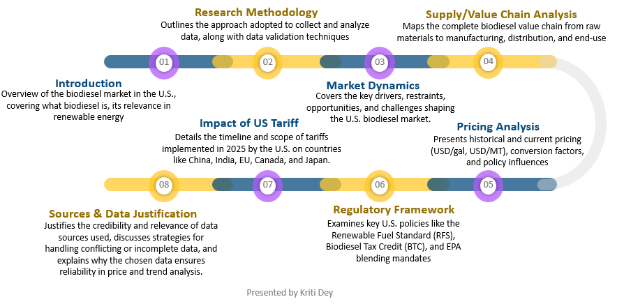
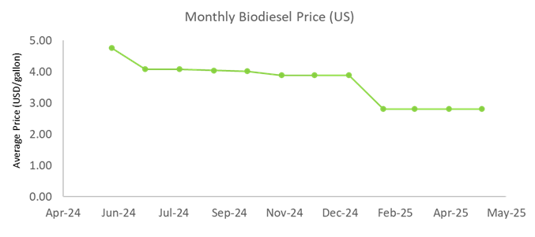
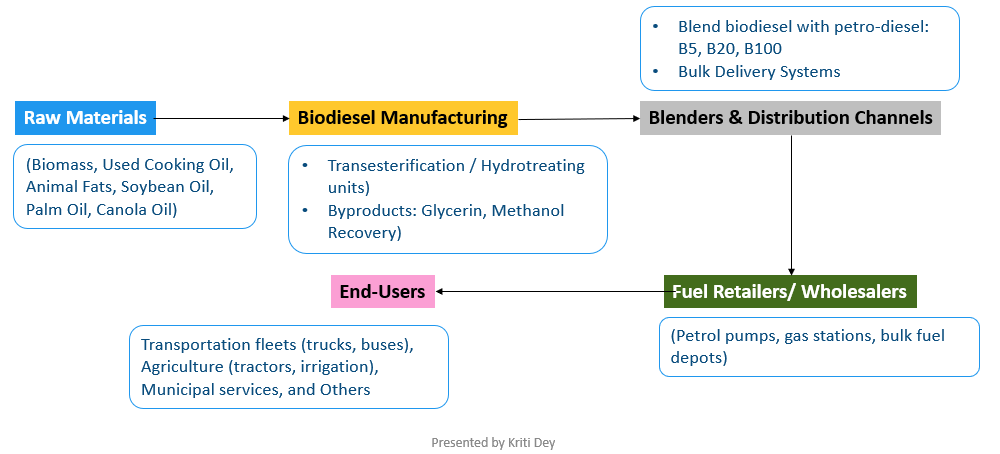
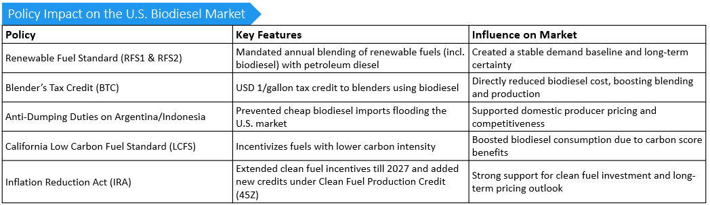

# U.S. Biodiesel Market Analysis (June 2024 – May 2025)

**Prepared by:** *Kriti Dey*  
**Format:** PowerPoint Presentation  
**Date:** Septemper 2025  
**Role:** Research Analyst  

---

## Project Overview
This analytical project evaluates **pricing trends, cost structures, and policy impacts** shaping the U.S. biodiesel market between **June 2024 and May 2025**.  
The work replicates a **real-world market research workflow**, integrating quantitative price modeling, policy evaluation, and forecasting to assess the short-term competitiveness of biodiesel in the U.S. energy mix.
Conducted a 12-month quantitative and policy-based assessment of the U.S. biodiesel market (2024–25), integrating validated datasets, cost driver modeling, and policy analysis to forecast near-term market trends.

---

## Objectives
- Extract and validate **12 months of biodiesel price data** (USD/gal, USD/MT) from official and secondary sources.  
- Assess **feedstock cost dependencies** and key **input cost drivers**.  
- Forecast **June–August 2025** biodiesel price outlook with documented assumptions.  
- Evaluate the **impact of energy policies, tax credits, and tariff changes** on market behavior.  
- Present findings through **structured, data-driven storytelling** and professional visualization.

---

## Methodology
**1. Data Collection**  
- U.S. Energy Information Administration (EIA)  
- USDA Agricultural Marketing Service  
- EPA Renewable Fuel Standard (RFS) dataset  
- Secondary market intelligence (Argus, Reuters, Biofuels Digest)

**2. Data Validation & Cleaning**  
- Cross-referenced feedstock indices (soybean oil, animal fats).  
- Normalized all values (USD/gallon → USD/MT).  
- Verified alignment with Renewable Identification Numbers (RINs) and federal credit benchmarks.

**3. Analytical Modeling**  
- Month-over-month price trend analysis and moving averages.  
- Linear trend regression for short-term forecasting.  
- Scenario modeling for tariff extensions and credit withdrawals.

**4. Visualization Tools**  
- **Excel:** Data organization and static charts  
- **AI Assistance (GPT-4):** Pattern interpretation and narrative structuring

---

## Key Highlights
- **Price Range:** B100 and B20 biodiesel averaged **USD 3.00–4.10 /gal** (≈ 906–1,240 USD/MT).  
- **Feedstock Impact:** Soybean oil volatility identified as a major cost driver.  
- **Forecast (June–Aug 2025):** Stable pricing outlook under moderate tariff pressure and continued tax credit support.  
- **Policy Analysis:** Reviewed *Trump 2025 tariff series*, *Blender’s Tax Credit (BTC)*, and *Inflation Reduction Act (IRA)* incentives.  
- **Value Chain Mapping:** From **biomass sourcing → production → distribution → transportation end use**.

---
### Visuals

#### 1. Scope 

#### 1. Price Trend (2024–2025)

#### 2. Value Chain Map

#### 3. Tariff & Policy Timeline

---

## Insights & Implications
- Continued **policy and tax credit support** is vital for biodiesel competitiveness.  
- **Feedstock diversification** could mitigate agricultural price volatility.  
- **Trade tariffs** introduce short-term uncertainty, offset by stable incentive frameworks.  
- Demonstrates the importance of **multi-source data validation** and **policy-market alignment** in forecasting.

---

## Skills Demonstrated
- Market data extraction and cross-validation  
- Policy and regulatory impact analysis  
- Forecasting and sensitivity modeling  
- Value chain & stakeholder mapping  
- Energy economics interpretation  
- Professional storytelling with evidence-based conclusions  

---
## 🎥 Final Deliverable

The outcome of this project is a **professional presentation deck** summarizing the market insights, forecast findings, and policy implications in a visually structured format — designed to mirror real consulting deliverables.

**🔗 View Full Deck:**  
[`us_biodiesel_price_analysis.xlsx`](us_biodiesel_price_analysis.xlsx)

The deck includes:
- **Executive summary** of key pricing and policy insights  
- **Data visualizations** (pricing trends, tariff impacts, value chain)  
- **Forecast assumptions** and modeling explanation  

> *Ideal for recruiters or hiring managers who prefer concise, visual demonstrations of research and analytical storytelling.*

**Connect with me:**  
🔗 [LinkedIn](your_link_here) | 💻 [GitHub](your_link_here)

